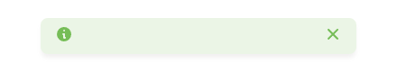
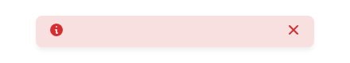
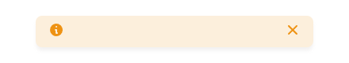

# Alert

Simple JavaScript Alert library.

## Installation & setup

### NPM

You can install the package via npm:

    npm install @bjnstnkvc/alert


Once the package has been installed, you can import it
using [import](https://developer.mozilla.org/en-US/docs/Web/JavaScript/Reference/Statements/import) declaration:

```js
import Alert from '@bjnstnkvc/alert'
```

Additionally, you can import default library styles:

```js
import '@bjnstnkvc/alert/src/alert.css'
```

### CDN

You can install the package via jsDelivr CDN:

```html
<script src="https://cdn.jsdelivr.net/npm/@bjnstnkvc/alert/lib/Alert.min.js"></script>
```

Additionally, you can import default library styles:

```html
<link rel="stylesheet" href="https://cdn.jsdelivr.net/npm/@bjnstnkvc/alert/src/alert.css">
```

## Usage

Once imported, you can make an AJAX request using the following methods:

```js
new Alert({ config })
```

## Config

In order to create an Alert, you need to pass `config` object. The Config object consists of the following properties:

#### container

A string representing the DOM element to which Alert will be appended (defaults to `body`):

```js
new Alert({
    container: '.element',
})
````

#### type

A string representing the type of Alert. The library comes with 4 predefined types (`success`, `error`, `warning`
and `info`)

```js
new Alert({
    type: 'success',
    ...
})
````

Depending on the type of choice, an Alert will look as follows:

| success                                   | error                                 | warning                                   | info                                |
|-------------------------------------------|---------------------------------------|-------------------------------------------|-------------------------------------|
|  |  |  |  |

#### message

A string representing an Alert message:

```js
new Alert({
    type: 'error',
    message: 'Something went wrong!', 
    ...
})
````

You can also pass HTML to the property: 

```js
new Alert({
    type: 'error',
    message: '<strong>Oops!</strong> Something went wrong.' ,
    ...
})
````

Example above would generate the following Alert:


#### duration

An integer value that determines for how long an Alert should be displayed (defaults to `5` seconds).

```js
new Alert({
    duration: 10,
    ...
})
````

#### expires

A boolean value that determines whether an Alert should expire/auto-close (defaults to `true`).

```js
new Alert({
    expires: false,
    ...
})
````

#### info

If passed as `boolean`, this property determines whether an Alert should have an info icon (defaults to `true`):

```js
new Alert({
    type: 'success',
    message: 'Payment completed!',
    info: false,
    ...
})
````
Example above would generate the following Alert:


You can pass an HTML string, which will then be rendered instead of a default icon:

```js
new Alert({
    type: 'success',
    message: 'Payment completed!',
    info: '<i class="far fa-credit-card"></i>',
    ...
})
````

Example above would generate the following Alert:


> **Note:** Example above uses [FontAwesome](https://fontawesome.com/) in order to display the icon which needs to be imported.  

#### close

If passed as `boolean`, this property determines whether an Alert should have a close icon (defaults to `true`):

```js
new Alert({
    type: 'info',
    message: 'Profile updated!',
    close: false,
    ...
})
````
Example above would generate the following Alert:


You can pass an HTML string, which will then be rendered instead of a default icon:

```js
new Alert({
    type: 'info',
    message: 'Profile updated!',
    icon: '<i class="far fa-times-circle"></i>',
    ...
})
````

Example above would generate the following Alert:


> **Note:** Example above uses [FontAwesome](https://fontawesome.com/) in order to display the icon which needs to be imported.

#### withProgress

A boolean value which determines whether an Alert should have a progress bar (defaults to `false`):

```js
new Alert({
    type: 'info',
    message: 'Verification email sent!',
    withProgress: true
})
````

Example above would generate the following Alert:


## Customization

#### colors

As mentioned in a [type](#type) section, the library comes with 4 predefined types (`success`, `error`, `warning` and `info`). 

In case you would like to change the color pallet, you have 2 options:

1. Change the color by redefining CSS variables:

```css
:root {
    --alert-success : rgba(118, 189, 87, 1);
    --alert-error   : rgba(214, 45, 48, 1);
    --alert-warning : rgba(238, 146, 19, 1);
    --alert-info    : rgba(63, 175, 239, 1);
}
```

2. Change the color by setting redefining CSS classes:

```css
.alert-success {
    color : rgba(118, 189, 87, 1);
}

.alert-error {
    color : rgba(214, 45, 48, 1);
}

.alert-warning {
    color : rgba(238, 146, 19, 1);
}

.alert-info {
    color : rgba(63, 175, 239, 1);
}
```

#### types

You can set your own Alert types, simply by passing it to the constructor. The library will dynamically create a CSS class when generating an Alert.


```js
new Alert({
    type: 'emergency',
    ...
})
````

Example above would generate the following HTML class:

```html
<div class="alert alert-emergency alert-is-open" role="alert">
    ...
</div>
```

#### styles

Alert is made of following CSS classes:

1. **alert** - Alert container.
2. **alert__info** - Alert Info icon element. 
3. **alert__message** - Alert Message element.
4. **alert__close** - Alert Close icon element.
5. **alert__progress** - Alert Progress Bar element.
6. **alert-is-open** - Class that's utilized when the Alert is open.
7. **alert-is-closed** - Class that's utilized prior to Alert being closed.

Feel free to redeclare these classes in your own CSS files and overwrite their properties in order to customize the Alert to your liking.
